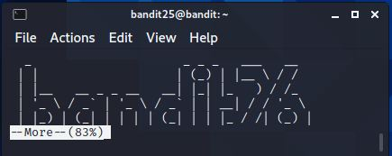
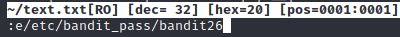
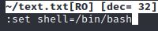
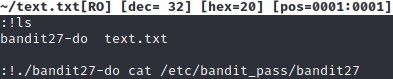
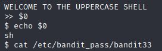

# OverTheWire - Bandit

[](https://overthewire.org/wargames/bandit/)

<details>
<summary><b>Table of Contents</b></summary>

- [Introduction](#introduction)
- [Connecting to Bandit](#connecting-to-bandit)
- [Level 0](#level-0)
- [Level 1](#level-1)
- [Level 2](#level-2)
- [Level 3](#level-3)
- [Level 4](#level-4)
- [Level 5](#level-5)
- [Level 6](#level-6)
- [Level 7](#level-7)
- [Level 8](#level-8)
- [Level 9](#level-9)
- [Level 10](#level-10)
- [Level 11](#level-11)
- [Level 12](#level-12)
- [Level 13](#level-13)
- [Level 14](#level-14)
- [Level 15](#level-15)
- [Level 16](#level-16)
- [Level 17](#level-17)
- [Level 18](#level-18)
- [Level 19](#level-19)
- [Level 20](#level-20)
- [Level 21](#level-21)
- [Level 22](#level-22)
- [Level 23](#level-23)
- [Level 24](#level-24)
- [Level 25](#level-25)
- [Level 26](#level-26)
- [Level 27](#level-27)
- [Level 28](#level-28)
- [Level 29](#level-29)
- [Level 30](#level-30)
- [Level 31](#level-31)
- [Level 32](#level-32)
- [Level 33](#level-33)

</details>

## Introduction

The `Bandit` wargame is a beginner series based around navigating the Linux command line. My goal was to find the simplest way and most efficient way to solve each challenge. However, due to the flexibility of the Linux command line, my solutions are just one of many ways to solve the challenges. If you find a better way, please feel free to share. Also, since this wargame was intended for beginners, I challenged myself to solve every level with a one-liner.

## Connecting to Bandit

**Challenge Description**

```
The goal of this level is for you to log into the game using SSH. The host to which you need
to connect is bandit.labs.overthewire.org, on port 2220. The username is bandit0 and the
password is bandit0. Once logged in, go to the Level 1 page to find out how to beat Level 1.
```

### Solution

All the information we need to login with is in the challenge description. Use the following command to connect:

```bash
ssh bandit0@bandit.labs.overthewire.org -p 2220
```

[*Back to top*](#overthewire---bandit)

## Level 0

**Challenge Description**

```
The password for the next level is stored in a file called readme located in the home
directory. Use this password to log into bandit1 using SSH. Whenever you find a password
for a level, use SSH (on port 2220) to log into that level and continue the game.
```

### Solution

The password to the `bandit1` account is in a file named `readme`. Use `cat` to read the password:

```bash
cat readme
```

[*Back to top*](#overthewire---bandit)

## Level 1

**Challenge Description**

```
The password for the next level is stored in a file called - located in the home directory
```

### Solution

The password to the `bandit2` account is in a file named `-`. When `-` is used as an argument, it is interpreted as stdin/stdout. To read the file, use a relative or full path to the file.

```bash
cat ./-
```

[*Back to top*](#overthewire---bandit)

## Level 2

**Challenge Description**

```
The password for the next level is stored in a file called spaces in this filename located in
the home directory
```

### Solution

The password for `bandit3` is stored in a file called `spaces in this filename`. In order to read the contents of the file, we can either escape the spaces with a backslash (`\`) or put quotes around the filename.

```bash
cat spaces\ in\ this\ filename
```

[*Back to top*](#overthewire---bandit)

## Level 3

**Challenge Description**

```
The password for the next level is stored in a hidden file in the inhere directory.
```

### Solution

The password for `bandit4` is stored in a hidden file in the `inhere` directory. We can use the command `ls -a` to show all files, including hidden ones.

```bash
cat inhere/$(ls -A inhere)
```

[*Back to top*](#overthewire---bandit)

## Level 4

**Challenge Description**

```
The password for the next level is stored in the only human-readable file in the inhere
directory. Tip: if your terminal is messed up, try the “reset” command.
```

### Solution

The password for `bandit5` is the only file that contains all human-readable characters in `inhere`. If we run the `file` command on a file that contains all human-readable characters, it will show as `ASCII text`. We can use `awk` to find the file containing the password.

```bash
cat $(file inhere/* | awk -F': ' '$2=="ASCII text" {print $1}')
```

[*Back to top*](#overthewire---bandit)

## Level 5

**Challenge Description**

```
The password for the next level is stored in a file somewhere under the inhere directory and
has all of the following properties:

    human-readable
    1033 bytes in size
    not executable

```

### Solution

We can use the `find` command to search for files matching the given parameters.

```bash
cat $(find ./ -size 1033c ! -executable) | tr -d "[:blank:]"
```

[*Back to top*](#overthewire---bandit)

## Level 6

**Challenge Description**

```
The password for the next level is stored somewhere on the server and has all of the
following properties:

    owned by user bandit7
    owned by group bandit6
    33 bytes in size

```

### Solution

We can use the `find` command to search for files matching the given parameters.

```bash
cat $(find / -size 33c -user bandit7 -group bandit6 2>/dev/null)
```

[*Back to top*](#overthewire---bandit)

## Level 7

**Challenge Description**

```
The password for the next level is stored in the file data.txt next to the word millionth
```

### Solution

Use grep to find the word `millionth`.

```bash
grep millionth data.txt | cut -f2
```

[*Back to top*](#overthewire---bandit)

## Level 8

**Challenge Description**

```
The password for the next level is stored in the file data.txt and is the only line of text that
occurs only once
```

### Solution

We can use `uniq` to find unique strings.

```bash
sort data.txt | uniq -u
```

[*Back to top*](#overthewire---bandit)

## Level 9

**Challenge Description**

```
The password for the next level is stored in the file data.txt in one of the few human-
readable strings, preceded by several '=' characters.
```

### Solution

For this challenge, we can use regex to find the password for us. From the challenge description, we know the password is preceded by several `=` characters, so we match that with `={2,}`. There may or may not be one or more whitespace separating the `=`s and the password, so we add `\s+?`, just in case. Since we only care about the password, we can use perl style regex, with the `-P` option, to discard this first half with `\K`. We also need to use the `-o` option to only print the matching expression. Using the password format from previous challenges, we know the password is 32 alphanumeric characters. We can match this with the POSIX class `[:alnum:]`. Since the file contains binary data, we need to use the `-a` option to search text strings.

```bash
grep -aoP "={2,}\s+?\K[[:alnum:]]{32}" data.txt
```

[*Back to top*](#overthewire---bandit)

## Level 10

**Challenge Description**

```
The password for the next level is stored in the file data.txt, which contains base64 encoded data
```

### Solution

Use the command `base64` to decode the text and search for the password format.

```bash
base64 -d data.txt | egrep -o [[:alnum:]]{32}
```

[*Back to top*](#overthewire---bandit)

## Level 11

**Challenge Description**

```
The password for the next level is stored in the file data.txt, where all lowercase (a-z) and
uppercase (A-Z) letters have been rotated by 13 positions

```

### Solution

The password is encrypted using ROT13. We can use the command `tr` to decrypt the text.

```bash
cat data.txt | tr [n-za-mN-ZA-M] [a-zA-Z] | egrep -o [[:alnum:]]{32}
```

[*Back to top*](#overthewire---bandit)

## Level 12

**Challenge Description**

```
The password for the next level is stored in the file data.txt, which is a hexdump of a file
that has been repeatedly compressed. For this level it may be useful to create a directory
under /tmp in which you can work using mkdir. For example: mkdir /tmp/myname123. Then
copy the datafile using cp, and rename it using mv (read the manpages!)
```

### Solution

For this level, we only have write access to the `/tmp` directory. We can use `xxd -r` to reverse the hexdump for us. Due to permissions on the `/tmp` directory, we have to be in the directory to extract the files, so we add `cd $d`.

```bash
d=$(mktemp -d)&&xxd -r ~/data.txt > $d/data&&cd $d
```

The file was repeatedly compressed with several different types of compression. We can use this while loop to continue decompressing until we reach `ASCII` text.

```bash
while true
do
    ext="$(file data | cut -d' ' -f2)"
    case $ext in
        "gzip") mv data data.gz&&gzip -d data.gz;;
        "bzip2") mv data data.bz2&&bzip2 -d data.bz2;;
        "POSIX") tmp="$(tar xvf data)"&&rm data&&mv $tmp data;;
        "ASCII") egrep -o [[:alnum:]]{32} data&&break;;
    esac
done
```

Finally, we add `cd ~;rm -rf $d` to clean up after we're done.

```bash
d=$(mktemp -d)&&xxd -r ~/data.txt > $d/data&&cd $d;while true;do ext="$(file data | cut -d' ' -f2)";case $ext in "gzip") mv data data.gz&&gzip -d data.gz;;"bzip2") mv data data.bz2&&bzip2 -d data.bz2;;"POSIX") tmp="$(tar xvf data)"&&rm data&&mv $tmp data;;"ASCII") egrep -o [[:alnum:]]{32} data&&break;;esac;done;cd ~;rm -rf $d
```

[*Back to top*](#overthewire---bandit)

## Level 13

**Challenge Description**

```
The password for the next level is stored in /etc/bandit_pass/bandit14 and can only be
read by user bandit14. For this level, you don’t get the next password, but you get a private
SSH key that can be used to log into the next level. Note: localhost is a hostname that
refers to the machine you are working on
```

### Solution

For this challenge, we are given the private key to `ssh` into the server as `bandit14`. We can use the `-i` option to login with the private key, and the `-o` option to disable the `StrictHostKeyChecking`. This allows us to skip the fingerprint prompt. We can also append a command to the end of `ssh` to execute it when we connect.

```bash
ssh bandit14@localhost -i sshkey.private -oStrictHostKeyChecking=no 'cat /etc/bandit_pass/bandit14' 2>/dev/null
```

[*Back to top*](#overthewire---bandit)

## Level 14

**Challenge Description**

```
The password for the next level can be retrieved by submitting the password of the current
level to port 30000 on localhost.
```

### Solution

We can connect to an open port with the `nc` command.

```bash
echo $bandit14_pass | nc localhost 30000 | egrep -o [[:alnum:]]{32}
```

[*Back to top*](#overthewire---bandit)

## Level 15

**Challenge Description**

```
The password for the next level can be retrieved by submitting the password of the current
level to port 30001 on localhost using SSL encryption.

Helpful note: Getting "HEARTBEATING" and "Read R BLOCK"? Use -ign_eof and read
the "CONNECTED COMMANDS" section in the manpage. Next to 'R' and 'Q', the 'B'
command also works in this version of that command...
```

### Solution

We can connect with SSL encryption using `openssl`.

```bash
echo $bandit15_pass | openssl s_client -quiet -connect localhost:30001 2>/dev/null | egrep -o [[:alnum:]]{32}
```

[*Back to top*](#overthewire---bandit)

## Level 16

**Challenge Description**

```
The credentials for the next level can be retrieved by submitting the password of the
current level to a port on localhost in the range 31000 to 32000. First find out which of
these ports have a server listening on them. Then find out which of those speak SSL and
which don’t. There is only 1 server that will give the next credentials, the others will simply
send back to you whatever you send to it.
```

### Solution

For this challenge, we can use `nmap` to help us find all the open ports within the given range.

```bash
nmap -p31000-32000 localhost | grep open | cut -d/ -f1
```

Some of the connections stay open, so we can use `timeout` to close them after we're done.

```bash
timeout 1 openssl s_client -quiet -connect localhost:$port 2>/dev/null
```

The password for the next stage is a SSH private key, so we have to change up our `grep` command. We can use the `-z` option to surpress newline characters in order for the `.+` to match everything between the header and footer.

```bash
egrep -oz "\-{5}BEGIN RSA PRIVATE KEY.+END RSA PRIVATE KEY\-{5}"
```

Then we put it all together in a `for` loop to iterate over each port.

```bash
for port in $(nmap -p31000-32000 localhost | grep open | cut -d/ -f1);do echo $bandit16_pass | timeout 1 openssl s_client -quiet -connect localhost:$port 2>/dev/null | egrep -oz "\-{5}BEGIN RSA PRIVATE KEY.+END RSA PRIVATE KEY\-{5}";done
```

[*Back to top*](#overthewire---bandit)

## Level 17

**Challenge Description**

```
There are 2 files in the homedirectory: passwords.old and passwords.new. The password
for the next level is in passwords.new and is the only line that has been changed between
passwords.old and passwords.new

NOTE: if you have solved this level and see 'Byebye!' when trying to log into bandit18,
this is related to the next level, bandit19
```

### Solution

The `diff` command can be used to find the line that's been changed. We can also use the `--changed-group-format` to format the output so it only shows what we want.

```bash
diff --changed-group-format='%>' --unchanged-group-format='' passwords.old passwords.new
```

[*Back to top*](#overthewire---bandit)

## Level 18

**Challenge Description**

```
The password for the next level is stored in a file readme in the homedirectory.
Unfortunately, someone has modified .bashrc to log you out when you log in with SSH.
```

### Solution

Since we know where the password is stored, we can use `ssh` to execute a command for us when it connects.

```bash
ssh bandit18@bandit.labs.overthewire.org -p 2220 'cat readme'
```

[*Back to top*](#overthewire---bandit)

## Level 19

**Challenge Description**

```
To gain access to the next level, you should use the setuid binary in the homedirectory.
Execute it without arguments to find out how to use it. The password for this level can be
found in the usual place (/etc/bandit_pass), after you have used the setuid binary.
```

### Solution

The `setuid` binary allows us to execute commands as `bandit20`. This allows us to read the password file as `bandit20`.

```bash
./bandit20-do cat /etc/bandit_pass/bandit20
```

[*Back to top*](#overthewire---bandit)

## Level 20

**Challenge Description**

```
There is a setuid binary in the homedirectory that does the following: it makes a connection
to localhost on the port you specify as a commandline argument. It then reads a line of text
from the connection and compares it to the password in the previous level (bandit20). If the
password is correct, it will transmit the password for the next level (bandit21).

NOTE: Try connecting to your own network daemon to see if it works as you think
```

### Solution

In order to solve this level, several things need to happen. First, we need to start a listener on a port. After we start the listener, we need to connect to that port with the `suconnect` binary, which then waits for you to send the password to it. If you send the correct password, it will respond with the password for the next level.

First, we need to start the listener. We can also `echo` the password into `nc` because it won't get sent until after a connection is initiated.

```bash
echo $bandit20_pass | nc -lp $port
```

Next, we connect to the listener with the `suconnect` program. To do this in the same line, we need to execute the listener in the background with `&`. We also need to use `sleep` before executing `suconnect` to give the listener time to finish executing.

```bash
echo $bandit20_pass | nc -lp $port &sleep .1;./suconnect $port
```

This part isn't necessary but you can use `$RANDOM` to generate a random port for you to use. However, since we need elevated permissions to use the well-known ports, we need to use `| 1024` to ensure the port is higher than 1023. We can also execute it in a subshell to get rid of the `job` status messages.

```bash
port=$(( $RANDOM | 1024 ));(echo $bandit20_pass | nc -lp $port &sleep .1;./suconnect $port >/dev/null)
```

[*Back to top*](#overthewire---bandit)

## Level 21

**Challenge Description**

```
A program is running automatically at regular intervals from cron, the time-based job
scheduler. Look in /etc/cron.d/ for the configuration and see what command is being
executed.
```

### Solution

For this challenge, the password was hiding in a file in the `tmp` directory. I could have easily just read the file and been done with it, but I wrote this command so that it would still work if the filenames changed.

```bash
cat $(cat $(cat /etc/cron.d/cronjob_bandit22 | head -1 | cut -d' ' -f3) | sed -n 2p | cut -d' ' -f3)
```

[*Back to top*](#overthewire---bandit)

## Level 22

**Challenge Description**

```
A program is running automatically at regular intervals from cron, the time-based job
scheduler. Look in /etc/cron.d/ for the configuration and see what command is being
executed.

NOTE: Looking at shell scripts written by other people is a very useful skill. The script for
this level is intentionally made easy to read. If you are having problems understanding what
it does, try executing it to see the debug information it prints.
```

### Solution

The password is hidden in a file in `/tmp` which is created using this script:

```bash
#!/bin/bash

myname=$(whoami)
mytarget=$(echo I am user $myname | md5sum | cut -d ' ' -f 1)

echo "Copying passwordfile /etc/bandit_pass/$myname to /tmp/$mytarget"

cat /etc/bandit_pass/$myname > /tmp/$mytarget
```

We can use `sed` to parse out the line that creates the hash and modify it so it contains the correct username.

```bash
eval $(cat $(cat /etc/cron.d/cronjob_bandit23 | head -1 | cut -d' ' -f3) | sed '4!d;s/\$myname/bandit23/');cat /tmp/$mytarget
```

[*Back to top*](#overthewire---bandit)

## Level 23

**Challenge Description**

```
A program is running automatically at regular intervals from cron, the time-based job
scheduler. Look in /etc/cron.d/ for the configuration and see what command is being
executed.

NOTE: This level requires you to create your own first shell-script. This is a very big step
and you should be proud of yourself when you beat this level!

NOTE 2: Keep in mind that your shell script is removed once executed, so you may want to
keep a copy around...
```

### Solution

For this challenge, there is a cronjob which runs this script every minute:

```bash
#!/bin/bash

myname=$(whoami)

cd /var/spool/$myname
echo "Executing and deleting all scripts in /var/spool/$myname:"
for i in * .*;
do
    if [ "$i" != "." -a "$i" != ".." ];
    then
        echo "Handling $i"
        owner="$(stat --format "%U" ./$i)"
        if [ "${owner}" = "bandit23" ]; then
            timeout -s 9 60 ./$i
        fi
        rm -f ./$i
    fi
done
```

This script checks the `/var/spool/bandit24` folder and deletes every file in that folder. However, before it deletes each file, it checks if the owner of that file is `bandit23`. If the owner is `bandit23`, it executes the file before deleting it. This allows us to execute any command we want with `bandit24` permissions.

First, we create a temporary directory and file for us to use. We can do this with the `mktemp` command:

```bash
d=$(mktemp -d);s=$(mktemp -p /var/spool/bandit24/ --suffix=.sh)
```

Next, we need a way for `bandit24` to read the password for us and leave it somewhere where we can access. We can do this with the `touch` command. This command will create a file in our temporary directory with the filename as the contents of `/etc/bandit_pass/bandit24`:

```bash
echo "touch $d/\$(cat /etc/bandit_pass/bandit24)"
```

Finally, we have to modify the permissions on our directory and script so that `bandit24` can access it. After waiting a minute to give the `cronjob` time to run, we list the contents of our temporary directory and we should see the password.

```bash
chmod 755 $s;chmod 733 $d;sleep 60;ls $d
```

Don't forget to clean up with `rm -rf` after we're done:

```bash
d=$(mktemp -d);s=$(mktemp -p /var/spool/bandit24/ --suffix=.sh);echo "touch $d/\$(cat /etc/bandit_pass/bandit24)" > $s;chmod 755 $s;chmod 733 $d;sleep 60;ls $d;rm -rf $d
```

[*Back to top*](#overthewire---bandit)

## Level 24

**Challenge Description**

```
A daemon is listening on port 30002 and will give you the password for bandit25 if given
the password for bandit24 and a secret numeric 4-digit pincode. There is no way to retrieve
the pincode except by going through all of the 10000 combinations, called brute-forcing.
```

### Solution

We can solve this challenge by using brace expansion to format the pin code.

```bash
for i in {0000..9999};do echo $bandit24_pass $i;done | nc localhost 30002 | egrep -o [[:alnum:]]{32}
```

[*Back to top*](#overthewire---bandit)

## Level 25

**Challenge Description**

```
Logging in to bandit26 from bandit25 should be fairly easy... The shell for user bandit26 is
not /bin/bash, but something else. Find out what it is, how it works and how to break out of
it.
```

### Solution

This challenge requires a bit more creativity to solve than the past levels. Unfortunately, I don't know of any way to pass this level with a one-liner. If you were able to do it, feel free to share with me.

When we first login with `bandit25`, we see `bandit26.sshkey` in our home directory. If we try to login with the key, we get this:

```bash
$ ssh -i bandit26.sshkey -oStrictHostKeyChecking=no bandit26@localhost
...
Connection to localhost closed.
```

This wasn't completely unexpected since the challenge description told us the shell wasn't `/bin/bash`. We can check what shell `bandit26` has by looking at the `passwd` file:

```bash
$ cat /etc/passwd | grep bandit26
bandit26:x:11026:11026:bandit level 26:/home/bandit26:/usr/bin/showtext
```

Looks like there is a custom shell being used for `bandit26`. Let's investigate:

```bash
$ file /usr/bin/showtext
/usr/bin/showtext: POSIX shell script, ASCII text executable
$ cat /usr/bin/showtext
#!/bin/sh
export TERM=linux
more ~/text.txt
exit 0
```

It looks like the shell for `bandit26` exits, but only after it executes `more ~/text.txt`. Lucky for us, we are actually able to escape from `more`. The first step is to get `more` to go into the interactive pager. We can do this by resizing the terminal until it's too small for the text to show on one page. If you did this correctly, you should see something like this:



if you check the manpage for `more`, you see that you can actually enter an editor by pressing `v`:

```
              v         Start up an editor at current line.  The editor is taken from the environment variable  VISUAL
                        if defined, or EDITOR if VISUAL is not defined, or defaults to vi if neither VISUAL nor EDITOR
                        is defined.
```

Once we enter `vi` editor mode, we can use the `:e` command to open another file.



Once we've copied the password, we can exit the `vi` editor by using `:q`, and then press `q` to exit out of `more`.

[*Back to top*](#overthewire---bandit)

## Level 26

**Challenge Description**

```
Good job getting a shell! Now hurry and grab the password for bandit27!
```

### Solution

We can solve this challenge with a slightly modified version of the last level. Instead of using the `:e` command, we can actually just enter a shell directly from `vi` by using `:!`. However, when you use the `:!` command, it attempts to execute it with the shell defined in the `shell` variable, which is currently set to `/usr/bin/showtext`. We will need to modify that first before we can execute any commands. This can easily be done by doing this:



Once we've changed the environment variable, we can execute any command we want.



[*Back to top*](#overthewire---bandit)

## Level 27

**Challenge Description**

```
There is a git repository at ssh://bandit27-git@localhost/home/bandit27-
git/repo. The password for the user bandit27-git is the same as for the user
bandit27.

Clone the repository and find the password for the next level.
```

### Solution

Unfortunately, I couldn't figure out a fancy one-liner to get rid of the `StrictHostKeyChecking` (at least not one that wasn't unnecessarily complex).

First, we have to create a temporary directory since we don't have write permissions to our home directory. Then we can clone the git repo to our temporary directory.

```bash
d=$(mktemp -d);git clone -q ssh://bandit27-git@localhost/home/bandit27-git/repo $d
```

The password is located within the `README` file in the cloned repo.

```bash
d=$(mktemp -d);git clone -q ssh://bandit27-git@localhost/home/bandit27-git/repo $d;egrep -o [[:xdigit:]]{32} $d/*;rm -rf $d
```

[*Back to top*](#overthewire---bandit)

## Level 28

**Challenge Description**

```
There is a git repository at ssh://bandit28-git@localhost/home/bandit28-
git/repo. The password for the user bandit28-git is the same as for the user
bandit28.

Clone the repository and find the password for the next level.
```

### Solution

Use `git show` to show all changes.

```bash
d=$(mktemp -d);git clone -q ssh://bandit28-git@localhost/home/bandit28-git/repo $d&&cd $d;git show | egrep -ow [[:xdigit:]]{32};cd ~;rm -rf $d
```

[*Back to top*](#overthewire---bandit)

## Level 29

**Challenge Description**

```
There is a git repository at ssh://bandit29-git@localhost/home/bandit29-
git/repo. The password for the user bandit29-git is the same as for the user
bandit29.

Clone the repository and find the password for the next level.
```

### Solution

The password for the next level is hidden in another branch named `dev`. We can view other branches with `git branch -a`.

```bash
d=$(mktemp -d);git clone -q ssh://bandit29-git@localhost/home/bandit29-git/repo $d&&cd $d;for branch in $(git for-each-ref --format="%(refname)");do git checkout -q $branch;git show | egrep -ow [[:xdigit:]]{32};done;cd ~;rm -rf $d
```

[*Back to top*](#overthewire---bandit)

## Level 30

**Challenge Description**

```
There is a git repository at ssh://bandit30-git@localhost/home/bandit30-
git/repo. The password for the user bandit30-git is the same as for the user
bandit30.

Clone the repository and find the password for the next level.
```

### Solution

```bash
d=$(mktemp -d);git clone -q ssh://bandit30-git@localhost/home/bandit30-git/repo $d&&cd $d;for i in $(git tag);do git show $i;done;cd ~;rm -rf $d
```

[*Back to top*](#overthewire---bandit)

## Level 31

**Challenge Description**

```
There is a git repository at ssh://bandit31-git@localhost/home/bandit31-
git/repo. The password for the user bandit31-git is the same as for the user
bandit31.

Clone the repository and find the password for the next level.
```

### Solution

```bash
d=$(mktemp -d);git clone -q ssh://bandit31-git@localhost/home/bandit31-git/repo $d&&cd $d;echo "May I come in?" > key.txt;git add -f key.txt;git commit -m "key.txt";git push 2>&1 | egrep -o [[:xdigit:]]{32};cd ~;rm -rf $d
```

[*Back to top*](#overthewire---bandit)

## Level 32

**Challenge Description**

```
After all this git stuff its time for another escape. Good luck!
```

### Solution

This challenge is another shell escape. Unfortunately, that means no one-liner for this either. Every character we send is converted to uppercase. Since Linux is case sensitive, none of the commands we try work. Fortunately, we can use a special parameter, `$0`, which expands to to the name of the shell that was set during initialization. This allows us to break out of the uppercase shell and into a regular `sh` shell.



[*Back to top*](#overthewire---bandit)

## Level 33

```
At this moment, level 34 does not exist yet.
```

[*Back to top*](#overthewire---bandit)
